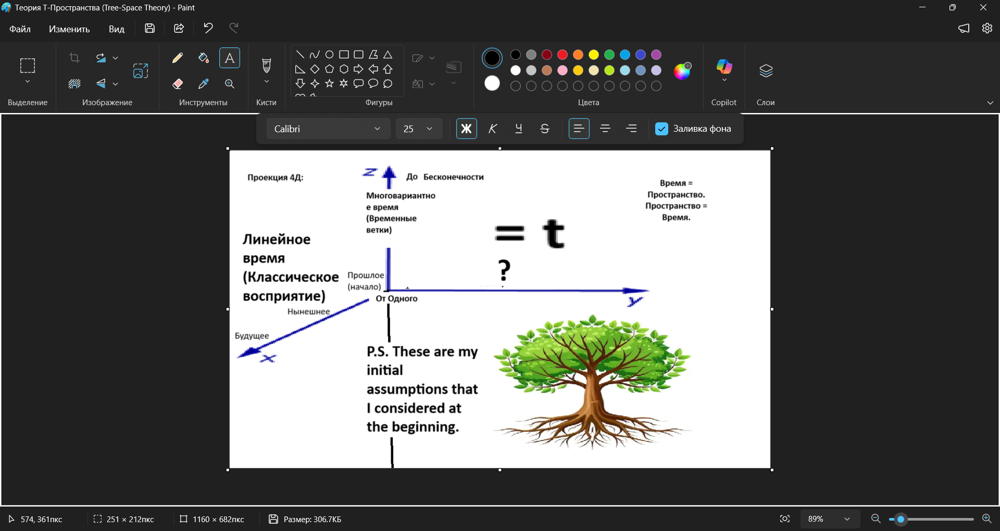
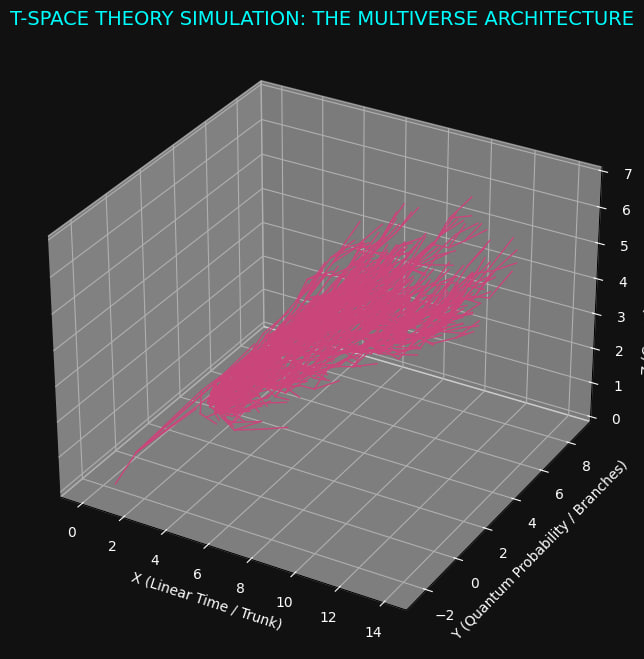

# 🌿 THE T-SPACE THEORY MANIFESTO: A NEW GEOMETRIC ARCHITECTURE OF THE MULTIVERSE

**Author:** DefinitelyNotNaL  
**Legal Concept Fixation:** February 21, 2026  
**Status:** Theoretical Framework / White Paper

---

### ABSTRACT

The contemporary understanding of the four-dimensional continuum (3D+1) is fundamentally incomplete. It describes the "how" of physical movement but ignores the "where" of quantum possibility and the "why" of gravitational time dilation. 

This manifesto introduces the **Tree-Space Theory (T-Space)**, a conceptual breakthrough by **DefinitelyNotNaL**. By shifting the paradigm from a static block universe to a dynamic, fractal-like structure, T-Space reconciles Einstein's relativity with the many-worlds interpretation of quantum mechanics.

---

## 1. THE ARCHITECTURE OF THE TRI-AXIAL SYSTEM (X, Y, Z)

The T-Space model replaces traditional spatial coordinates with functional evolutionary vectors. This is not just a coordinate system; it is the "circulatory system" of reality.

### 🌿 Axis X: The Trunk (Linear Chronology)
The X-axis represents the solidified path of history. It is the "wood" of the tree—events that have already occurred or are strictly bound by the arrow of time. In our daily perception, we crawl along this axis like insects on a branch, unaware of the greater structure.

### 🌿 Axis Y: The Branches (Quantum Divergence)
The Y-axis is the dimension of "What If". It represents the total sum of all probability branches. Every quantum fluctuation and every conscious decision creates a displacement along the Y-vector. In a 4D-restricted view, this axis is invisible; in the 5D T-Space model, it becomes a navigable landscape of the Multiverse.

### 🌿 Axis Z: The Roots (Causal Depth & Physical Constants)
The Z-axis is the most profound discovery of this theory. It represents the "Root System"—the fundamental laws of physics and the density of the gravitational field. Movement along the Z-axis is not movement through space, but movement through the **intensity** of reality itself. The deeper the roots, the slower the flow of time on the X-axis.

**P.S.** As shown in the sketch, the transition from human perception (Linear Time) to the actual fractal structure of the Multiverse was the core focus of this research.

This is a new 3D version.

---

## 2. THE DIMENSIONAL REVOLUTION: REDEFINING 4D AND 5D

One of the core tenets of the **DefinitelyNotNaL** model is the qualitative separation of dimensions:

* **The 4D Projection (X + Z):** This is the world of "Hard Physics" and General Relativity. It consists only of the Trunk and the Roots. In 4D, the universe is a deterministic machine—there is time and there is gravity, but there is no choice. Everything is a pre-calculated result of the Root laws.

* **The 5D Expansion (X + Z + Y):** This is the True Reality. By adding the Y-axis (Branches), we introduce the possibility of divergence. 5D is where life, consciousness, and the Multiverse exist.

---

## 3. THE DEFINITELYNOTNAL METRIC & THE "PIT" PHENOMENON

To mathematically anchor the T-Space, we utilize the following metric equation:

$$d\Sigma^2 = f(G_z) dT_x^2 + dW_y^2 - \frac{1}{f(G_z)} dG_z^2$$

This formula describes the **Event Interval** within the Tree-Space. It provides a radical explanation for the Singularity: When a subject "digs a pit" into the Z-axis (approaching a Black Hole), the gravitational function $f(G_z)$ approaches zero. 

Mathematically, this forces the Linear Time component ($dT_x$) to vanish, while the Causal Depth ($dG_z$) expands to infinity. This proves that **Black Holes are not objects, but "Root Access Points"** where time is discarded in favor of pure causal information.

---

### 🛰 VISUAL EVIDENCE (T-SPACE SIMULATION)

The visual data below confirms the branching logic of the Multiverse architecture.

---

## 4. THE NAVIGATOR'S DYNAMICS (HYPOTHESIS)

To quantify the transition between Branches (Y-axis), we introduce the **Navigator's Formula**:

$$\Delta Y \approx \frac{E_{obs}}{M_{trunk}}$$

* **$\Delta Y$:** The degree of shift into an alternative probability branch.
* **$E_{obs}$:** The informational/quantum energy of the observer's choice.
* **$M_{trunk}$:** The causal inertia (mass) of the established timeline.

**Implication:** This explains why microscopic systems exhibit high fluidity (quantum jumps), while macroscopic systems remain deterministic (stable Trunk). High-level change requires observation energy that exceeds the momentum of past events.

---

## 5. COSMOLOGICAL EVOLUTION & THE FOREST HYPOTHESIS

The T-Space Theory introduces biological-like dynamics to the structure of reality:

* **Dry Branches:** Probability branches (Y) that lack "Observation Energy" ($E_{obs}$) eventually wither and detach from the Tree. Neglected possibilities cease to exist physically.

* **The Parasitic Logic:** Information-based entities may attempt to stabilize their existence by "leeching" $E_{obs}$ from established Trunks, effectively hijacking foreign timelines.

* **The Seeds (Universal Rebirth):** Black Holes are not dead ends; they are "Seeds". Upon reaching critical information mass in the Roots (Z), they trigger a new Big Bang, planting a new Tree in the infinite Forest of the Multiverse.

---

## CONCLUSION

The T-Space Theory offers a unified vision of a living Universe. We are not merely passive observers of a ticking clock; we are navigators of a vast fractal tree. The transition from 4D to 5D is the next step in human understanding.

---

**© 2026 DefinitelyNotNaL. All rights reserved.** Intellectual property of the T-Space conceptual framework is tied to the initial commit of this repository.
